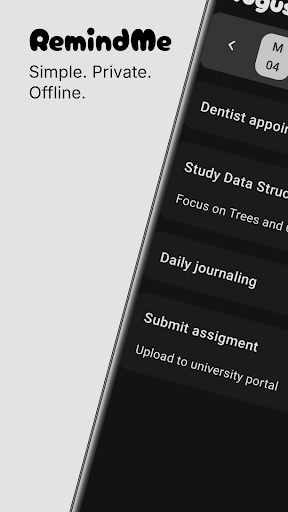
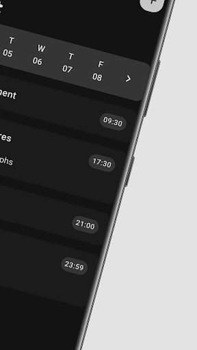
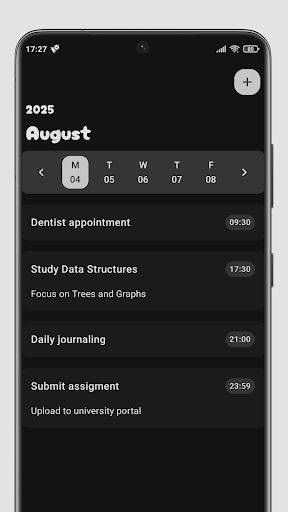
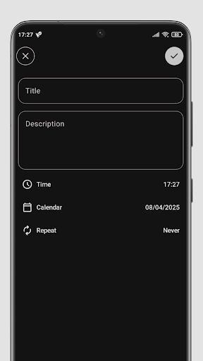

# RemindMe

Simple, private, and offline reminder app.

Easily set quick reminders for your tasks, events, and daily routines.
No accounts, no internet needed — everything stays on your device.
Designed to be lightweight and distraction-free, so you can focus on what matters.

Stay organized while keeping your data private.

## Features

- Create reminders for tasks, events, and daily routines.
- Works completely offline.
- No accounts or login required.
- Lightweight, minimalistic interface for better focus.
- Privacy-first: all data stays on your device.

## Screenshots






## Installation

### From Play Store

Download and install RemindMe directly from the [Play Store](https://play.google.com/store/apps/details?id=com.cabovianco.remindme).

### From Source Code
1. Clone this repository:
   ```bash
   git clone https://github.com/cabovianco/android-remindme-app.git
   ```
2. Open the project in Android Studio.
3. Build and run the app on your device or emulator.

## Technologies

- **Platform & Language:** Android, Kotlin.
- **Architecture:** MVVM, Clean Architecture.
- **UI:** Jetpack Compose, Splash Screen.
- **Data & Concurrency:** Room, Kotlin Coroutines, Kotlin StateFlow, AlarmManager.
- **Dependency Injection:** Dagger Hilt.
- **Navigation:** Navigation Compose.

## License

This project is licensed under the MIT License. See the [LICENSE](LICENSE) file for details.
