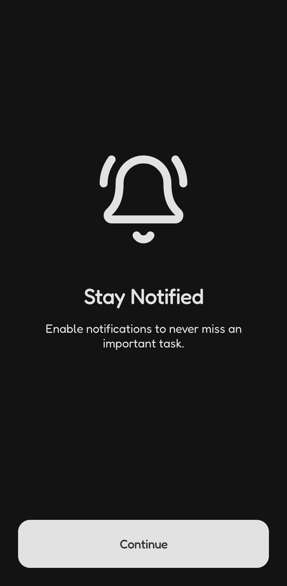
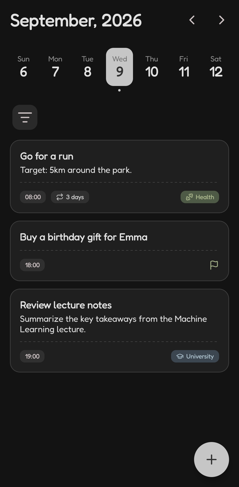
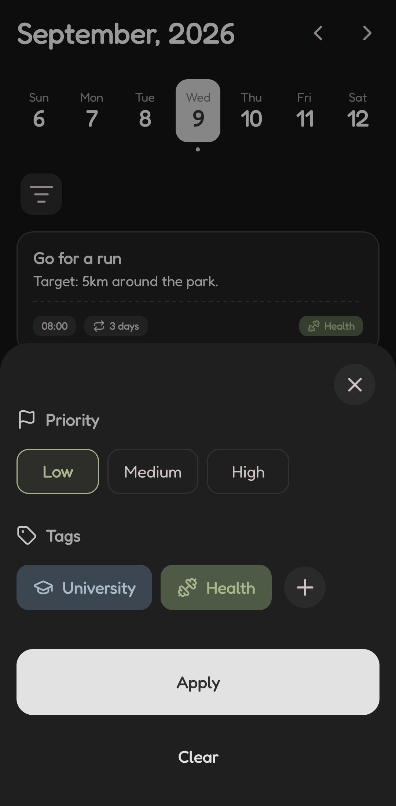
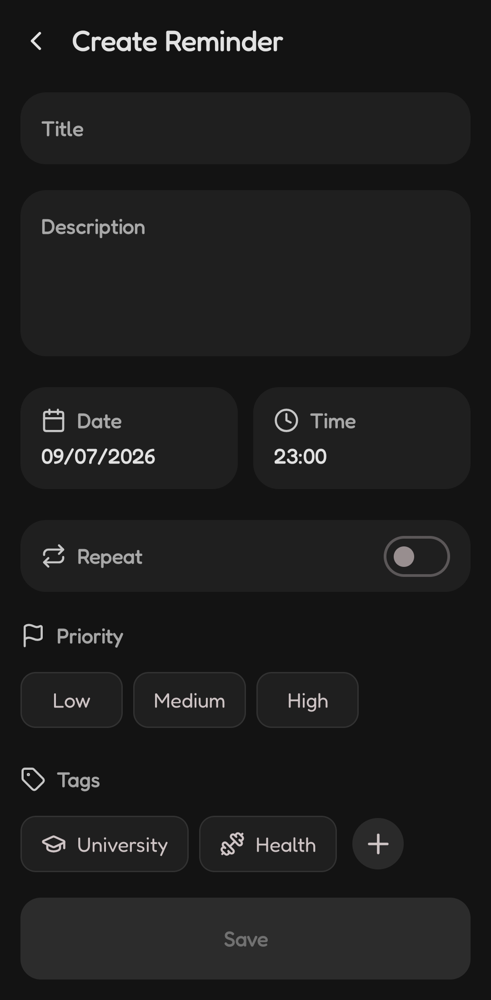
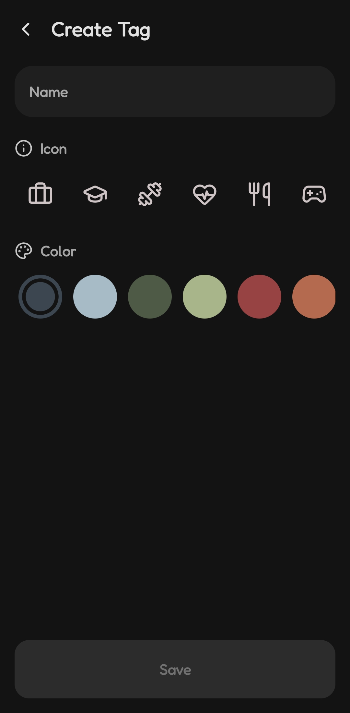

# RemindMe

RemindMe is a simple, private, and offline reminder app designed to easily set quick reminders for
tasks, events, and daily routines.

It ensures that all data stays on your device, requiring no accounts or internet connection.

## Features

- Create, edit, and manage reminders.
- Schedule one-time or recurring reminders.
- Set priorities to stay focused on what matters.
- Organize reminders with customizable tags.
- Quickly find reminders using tag filters.
- Snooze notifications for later.
- Keep all your reminders stored locally.
- Clean and distraction-free interface.

## Screenshots

|                                              |                                              |
|:--------------------------------------------:|:--------------------------------------------:|
|  |  |
|  |  |
|  |  |

## Installation

### From Play Store

Download and install RemindMe directly from
the [Play Store](https://play.google.com/store/apps/details?id=com.cabovianco.remindme).

### From Source Code

1. Clone this repository:
    ```bash
    git clone https://github.com/cabovianco/android-remindme-app.git
    ```
2. Open the project in Android Studio.
3. Build and run the app on your device or emulator.

## Technologies

- **Language:** Kotlin.
- **Architecture:** MVVM, Clean Architecture.
- **UI:** Jetpack Compose, Material Design 3, Navigation Compose, Splash Screen.
- **Local Storage:** Room, Preferences DataStore.
- **Scheduling:** AlarmManager.
- **Asynchronous & Data:** Kotlin Coroutines, Kotlin Flow, Kotlin Serialization.
- **Dependency Injection:** Dagger Hilt.
- **Firebase:** Crashlytics & Analytics.

## App Structure

The app follows **Clean Architecture** principles, organized into the following package structure:

```text
com.cabovianco.remindme
├── data/                   # Implementation of data sources
│   ├── alarm/              # Alarm scheduling (AlarmManager)
│   ├── local/              # Room database and Preferences DataStore
│   └── repository/         # Repository implementations
│
├── di/                     # Dependency Injection modules
│
├── domain/                 # Business logic
│   ├── model/              # Domain entities
│   ├── repository/         # Repository interfaces
│   └── usecase/            # Domain operations
│
└── presentation/           # UI Layer
    ├── navigation/         # Screen definitions and NavHost
    ├── notification/       # Notification and BroadcastReceivers
    ├── state/              # States
    ├── ui/
    │   ├── screen/         # Screens and components
    │   ├── theme/          # App theme (color, type, etc.)
    │   └── util/           # UI Utilities
    └── viewmodel/          # ViewModels
```

## Room Data Modeling

The local database structure is organized as follows:

### `reminders` Table

Stores the information for each reminder.

- **Fields:**
    - `id`: Primary Key (Long, Auto-generated).
    - `title`: The title of the task or event.
    - `description`: Optional extra details.
    - `dateTime`: The scheduled date and time (stored as ISO Zoned Date Time).
    - `repeat`: Recurrence type (stored as JSON string to support intervals and custom days).
    - `priority`: Reminder priority (stored as String).

### `tags` Table

Stores the information for each tag.

- **Fields:**
    - `id`: Primary Key (Long, Auto-generated).
    - `name`: The name of the tag.
    - `color`: The foreground and background colors (stored as JSON string).
    - `icon`: Optional icon (stored as JSON string).

### `reminder_tag` Table

Join table for the many-to-many relationship between reminders and tags.

- **Fields:**
    - `reminderId`: Foreign Key to `reminders.id`.
    - `tagId`: Foreign Key to `tags.id`.

## License

This project is licensed under the MIT License. See the [LICENSE](LICENSE) file for details.
